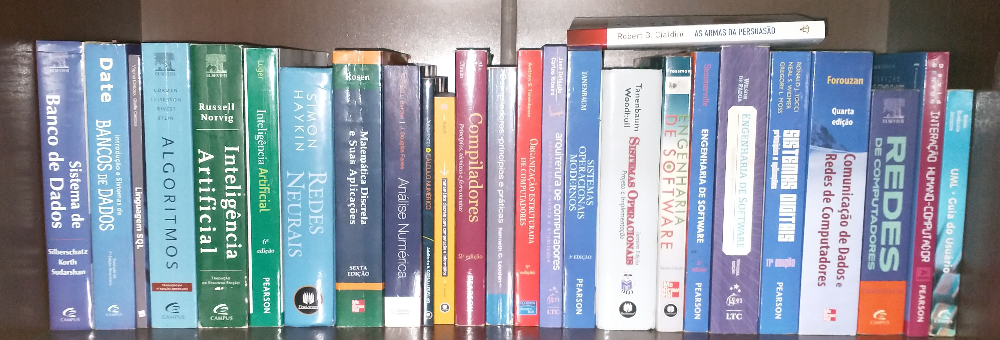
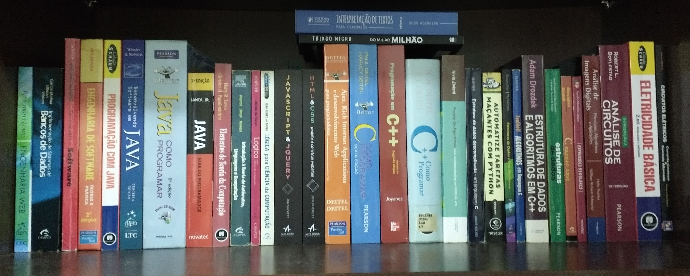

# Meus Livros Computação

## Meus livros da minha biblioteca particular nas áreas de:
* Algoritmos,
* Bancos de dados,
* Inteligencia Artificial,
* Programação Web Backend e Frontend,
* Engenharia de software,
* entre outros. 
* **Tenho vários livros em mídia digital também**
## Já li e pratiquei muito durante esses anos, li praticamente todos eles em especial: Expreções regulares, Algoritmos (cormen), Inteligencia Artifical (Norvig), Sistema Operacional, Redes, Engenharia de software, Bancos de Dados, Desenvolvimento WEB.

## Fotos

---

